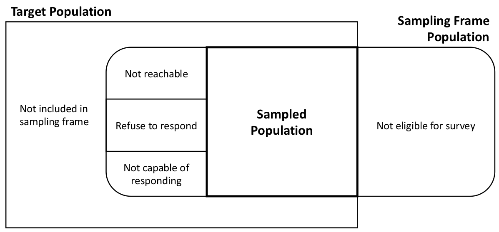
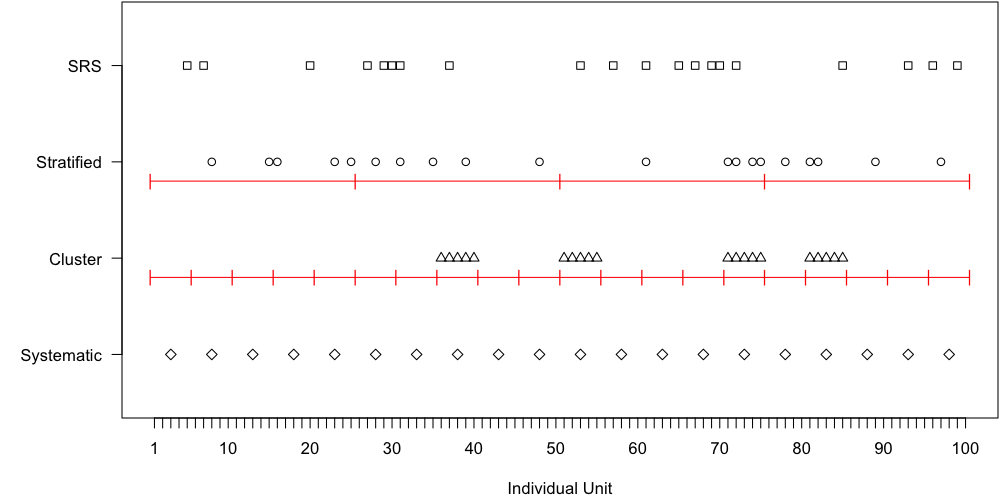

## Outline

::::: columns
::: {.column width="50%"}
**Topics**

-   Overview of the class (syllabus)
-   Why sample?
-   Vocabulary of sampling
-   Probability vs Non-probability samples
-   Types of probability surveys
:::

::: {.column width="50%"}
**Activities**

-   1.1 Vocabulary of Surveys
-   1.2 Sampling CPH Faculty
:::
:::::

 

**Assignments**

-   "About Me" questionnaire due Thursday 8/28/2025 11:59pm via Carmen
-   Problem Set 1 due Thursday 9/4/245 11:59pm via Carmen

## Why do we sample?

**Census** – measurement taken on **all** units in the population

**Sample** – measurements taken on a **subset** of units in the population

 

Reasons we might want to sample:

## Vocabulary of Survey Sampling

-   **Observation Unit (or Element)** - One (non-overlapping) unit on which a measurement is taken

-   **Target Population** - Complete collection of observation units that we want to study

-   **Sample** - A subset of a population (that will be/has been measured)

-   **Sampled Population** - All observation units that could possibly be in the sample

    -   The population from which the sample was actually taken

-   **Sampling Unit** - A unit that can be selected for a sample

    -   Might be an observation unit, or might be a collection of observation units, e.g., a household

-   **Sampling Frame** - A list of all sampling units (for some sampling designs this might not actually be available)

------------------------------------------------------------------------

Imagine a telephone survey of likely voters

-   Observation unit = one person
-   Target population = all people eligible to vote who are likely to vote
-   Sampling unit = one household/one phone number (could be one person if cell phone frame)
-   Sampling frame = list of residential phone numbers (or, list of cell phone numbers)

Mismatch between **target population** and **sampled population** certainly possible

{fig-alt="Venn diagram showing the overlap between the target population, sampling frame, and sampled population in a survey, highlighting exclusions due to ineligibility or nonresponse."}

## Activity 1.1 (Part 1)

Vocabulary of Survey Sampling (Part 1)

## Probability vs Non-Probability Samples

[**Probability Sample**]{style="color:#cc0000"} – each unit in the population has a known, positive probability of selection, and randomness is involved in the selection of which units are actually included in the sample

[**Non-Probability Sample**]{style="color:#0000cc"} – the probability a unit is included in the sample cannot be calculated

 

::: fragment
[**Types of Non-Probability Samples**]{style="color:#0000cc"}
:::

::: incremental
-   **Convenience sampling** – units are selected into the sample simply because they are easy to select
-   **Voluntary/Self-selection sampling** – units self-select into the sample
-   **Quota sampling** – pre-specify the number of units you want to end up with in each subgroup, and select them via convenience or other non-probability method
    -   Most famous example: pre-election polls for 1948 election (Dewey vs Truman)
-   **Purposive/Judgement sampling** – researcher selects units into the sample based on their own judgement
-   **Snowball/Respondent-Driven sampling** – start by including one or more units in the (usually "hard-to-reach") population, then use these units to identify further units
:::

## Example

Sampling OSU students with various non-probability schemes

::: incremental
-   **Convenience sampling** – Recruit OSU students to take your survey by standing outside the library and asking students if they will participate
-   **Voluntary/Self-selection sampling** – Put up a flyer with a URL for your survey, and interested students can go to the website and take the survey
-   **Quota sampling** – Pre-specify that you’ll get 100 students from Ohio and 100 students from outside Ohio to take your survey, and stand outside the library to find these students
-   **Purposive/Judgement sampling** – You pick students with specific characteristics that you are most interested in having in your sample
-   **Snowball/Respondent-Driven sampling** – You identify a few students who are in your target population (e.g., use illicit drugs), and then have them pass along your survey information to other students they know who are in the population (e.g., other drug users)
:::

## (Big) Problem: Selection Bias

[**Selection bias**]{style="color:#0000cc"} = bias that arises when part of the target population is not in the sampled population, or, more generally, when some population units are sampled at a different rate than intended by the investigator

Predominant concern with non-probability samples

-   Units (people) in the sample might be really different from non-sampled units – but we don’t know how they are different
-   Even if, say, the distribution of state of residence (Ohio, Not Ohio) is the same in your non-probability sample as in the target population, there is no guarantee that the students are "representative" of the target population
    -   e.g., Ohioans who self-select into your sample might be different than Ohioans who do not
-   Selection bias an also be a problem for probability samples when there is [nonresponse]{style="color:#43a047"}

**This course will focus exclusively on probability samples.**

If you are interested in learning more about how non-probability samples can be combined with probability samples to improve inference, let me know.

## Main Types of Probability Samples

1.  [Simple Random Sample (SRS)](#slide-srs)

    -   SRSWR = Simple random sample **with** replacement

    -   SRS(WOR) = Simple random sample **without** replacement

2.  [Stratified random sample](#slide-strat)

3.  [Cluster sample](#slide-clus)

4.  [Systematic sample](#slide-sys)

5.  [Probability Proportional to Size (PPS)](#slide-pps)

## Simple Random Sample (SRS) {#slide-srs}

**SRS** – every possible subset of $n$ units in the population has the same chance of being in the sample

-   Note: every unit has equal probability of selection is a *necessary but not sufficient* condition for an SRS

**Subtypes:**

-   **Simple random sample with replacement (SRSWR)** – a unit could be selected into the sample more than once
    -   Pick a unit each with equal probability, put it back, pick another unit
    -   Sometimes called **unrestricted random sampling (URS)**
-   **Simple random sample without replacement (SRSWOR or just SRS)** – a unit can only be selected into the sample once
    -   Once a unit is selected into the sample, it cannot be selected again

In general when survey samplers say "SRS" we mean SRSWOR

## Stratified Random Sample {#slide-strat}

::: {r-fit-text}
**Stratified Random Sample** – divide population into $H$ distinct subgroups called strata, and take SRS from each stratum, with each SRS taken independently

-   Strata must be mutually exclusive (each unit only belongs to 1 stratum)
-   Strata must be exhaustive (all units belong to a stratum)
-   Strata are often subgroups of interest

Pros/Cons:

-   Ensures (at least some) elements are selected from each stratum (subgroups)
-   Can **reduce variance** in overall estimates (increase precision) relative to an SRS
    -   If differences among strata explain a significant proportion of the variability in the attribute of interest, gain in precision can be large

**Allocation Method** - how much of the sample comes from each stratum
:::

## Cluster Sample {#slide-clus}

::: {r-fit-text}
**Cluster Sample** – individual units in the population are aggregated into larger sampling units called [clusters]{style="color:#0000cc"}, and a sample of clusters is selected

-   Often used when you do not have a full list of individual units in the population, but you do have a list of all clusters in the population
    -   Example: Have list of all residences but not names of all residents

Pros/Cons:

-   Can be less expensive to field compared to other designs (e.g., SRS)
-   Can cause a decrease in precision relative to SRS, because individual units within a cluster tend to be similar

**Subtypes:**

-   One-stage cluster sample – select all units from the selected clusters into the sample
-   Two-stage cluster sample – only select some units from the selected clusters into the sample
:::

## Systematic Sample {#slide-sys}

::: {r-fit-text}
**Systematic Sample** – a starting point is chosen from a list of population units, and that unit and each $k$th unit after that one on the list is chosen.

Pros/Cons:

-   Easy to implement
-   If the list is randomly ordered, systematic sample will behave like an SRS and you can use analysis methods appropriate for an SRS
-   But, it is **not an SRS**, because all possible subsets of nunits do not have the same probability of being sampled
    -   For example, if the 100th unit is chosen, the 101st unit cannot be chosen – so the probability of a sample that contains both of these units is 0 (but the probability of other samples is \>0)
-   Systematic sampling is technically a form of cluster sampling

Example paper: [Pinterest Homemade Sunscreens: A Recipe for Sunburn (Merten et al., 2010)](https://www.tandfonline.com/doi/full/10.1080/10410236.2019.1616442){.uri}
:::

## Probability Proportional to Size (PPS) {#slide-pps}

**Probability Proportional to Size** - the probability a unit is selected into the sample is directly proportional to a size measure that is known for all units before sampling

Pros/Cons:

-   Can **reduce variance** when units vary substantially in size
-   Must know the "size" of all units before sampling
    -   E.g., sampling counties in the U.S. using number of people who live there as the "size"
-   Often used as part of a complex design, not as the only design feature

## Visualization

-   Population of $N = 100$ individual units, want sample of $n = 20$
-   Strata: 4, each with 25 units
-   Clusters: 20, each with 5 units

{fig-alt="illustration showing four lines each with a different set of units sampled."}

## Combining Design Features

[**Complex Samples**]{style="color:#ff8c00"} - surveys with [more than one of these elements]{style="color:#ff8c00"}, e.g., stratified cluster sample, two-stage cluster sample

 

One specific feature you may encounter:

[**EPSEM sampling**]{style="color:#dd00ff"} - Equal Probability of Selection Method

-   **Not** a specific sampling method, instead this refers to using a sampling technique that results in each population unit having the same probability of selection

-   Also called a **self-weighting sample**

-   By definition SRS and Systematic sampling are EPSEM; other designs can be as well (stratified, cluster, multistage)

-   Historically EPSEM samples were preferred due to computing limitations; now not so important (and often we *want* to oversample certain subgroups)

## Activity 1.1 (Part 2)

Vocabulary of Survey Sampling (Part 2)
