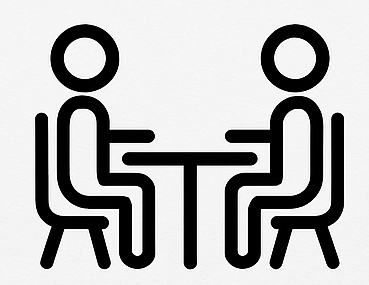
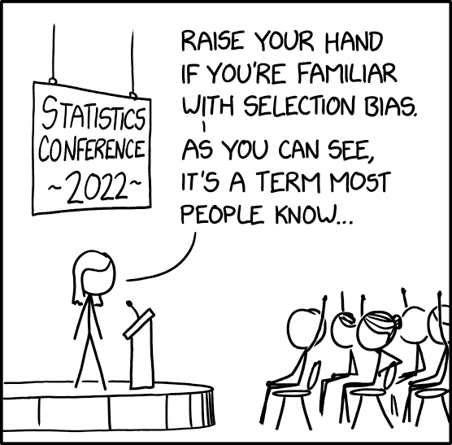

## Outline

::::: columns
::: {.column width="50%"}
**Topics**

-   Designing Survey Questions
-   Survey Modes
-   Total Survey Error (TSE) framework
:::

::: {.column width="50%"}
**Activities**

-   2.1 Survey Questions
-   2.2 OPAS Sources of Error
:::
:::::

**Readings**

-   Dillman DA and Christian LM (2005). Survey Mode as a Source of Instability in Responses across Surveys. *Field Methods*, 17(1), 30-52. (PDF on Carmen)

**Assignments**

-   Problem Set 1 due Thursday 9/4/25 11:59pm via Carmen
-   Peer Evaluation of Problem Set 1 due Tuesday 9/9/25 11:59pm via Carmen
-   Quiz 1 due Thursday 9/11/25 11:59pm via Carmen

## Designing Survey Questions

:::: {r-fit-text}
Assuming the observation unit is a **person**, questions should be ...

::: incremental
-   Simple and clear

    -   Beware words that might be interpreted differently by different people, or might not be understood by some people

-   Specific, not general

    -   (not good) "Have you ever been attacked?"

    -   (better) "Has anyone ever attacked you in any of these ways: (a) With any weapon, for example, a gun or knife, (b) With anything like a baseball bat, frying pan, scissors..."

-   Related to the concept of interest

    -   Reusing questions from previous surveys allows for historical comparison -- if appropriate for the audience/topic

-   Carefully ordered

    -   Responses to a question may be unduly influenced by question(s) that preceded it

    -   Usually best to ask more general question first, followed by specific question(s)
:::
::::

## Designing Survey Questions

Questions should be (cont.)...

::: incremental
-   Not leading or “loaded” questions

    -   Questions can be written to lead the respondent to the answer you want to hear — don't do this!

-   Not written as double-negatives

    -   (not good) “Do you favor or oppose not allowing drivers to use cell phones while driving?”

    -   (better) “Do you agree with laws banning cell phone use while driving?”

-   Not double-barreled

    -   Be sure to ask only one concept per question

-   If closed-ended, all response options are available

    -   Make sure all respondents would be able to endorse *at least one* answer

-   If multiple-choice/forced-choice, response options are mutually exclusive and exhaustive

    -   Make sure all respondents would be able to select *just one* answer
:::

## Activity 2.1: (Part 1)

Survey Questions (Part 1)

## Survey Modes

Four ways we could get information from a sampled person, called the **survey mode**:

::: {layout-ncol="4"}
{fig-alt="Icon depicting two people sitting across from each other at a table, representing face-to-face survey interaction." width="80%"}

{fig-alt="Icon showing an envelope with a paper emerging from it, symbolizing mail-based survey distribution." width="80%"}

{fig-alt="Icon of a traditional telephone handset, indicating phone-based survey communication." width="80%"}

{fig-alt="Icon of a computer monitor with a survey form displayed, representing internet-based survey participation." width="80%"}
:::

High-level differences include:

::::: columns
::: {.column width="50%"}
-   Cost

-   Use or non-use of an interviewer

-   Availability of visual aids

-   Enforcement of “skip patterns”
:::

::: {.column width="50%"}
-   Issues with the frame

-   Types of biases likely to be present

-   Availability of (and types of) paradata

    -   Paradata = data collected about the survey process (e.g., how long the interview took)
:::
:::::

## Mode: Face-to-Face

Survey completed in-person via an interviewer, traditionally via door-to-door canvassing (considered “gold standard”)

[**Pros:**]{.absolute top="180"}

[**Cons:**]{.absolute top="380"}

[**Frame Considerations:**]{.absolute top="600"}

## Mode: Mail/Written

Survey completed by respondent with paper and pencil (“PAPI”), usually sent via mail

[**Pros:**]{.absolute top="180"}

[**Cons:**]{.absolute top="380"}

[**Frame Considerations:**]{.absolute top="600"}

## Mode: Phone

Survey completed over the phone – in practice, usually “CATI” (Computer Aided Telephone Interview) where computer is used by interviewer (not by respondent)

[**Pros:**]{.absolute top="180"}

[**Cons:**]{.absolute top="380"}

[**Frame Considerations:**]{.absolute top="600"}

## Mode: Internet

Survey completed online, often called “CAWI” (Computer Aided Web Interview)

[**Pros:**]{.absolute top="180"}

[**Cons:**]{.absolute top="380"}

[**Frame Considerations:**]{.absolute top="600"}

## Activity 2.1 (Part 2)

Survey Questions (Part 2)

## Survey Errors

Historically, survey methodologists described errors as "Sampling Errors" and "Non-Sampling Errors"

More modern approach is the **Total Survey Error approach**

 

**Total Survey Error** = difference between population parameter (the truth) and the estimate of that parameter based on a sample survey

 

[**Two types of survey error:**]{style="color:#cc0000"}

1.  **Random error** -- random fluctuation from sample to sample
    -   Should "cancel out" in terms of bias of the sample estimate but will increase variance (reduce precision)
2.  **Systematic error** -- e.g., underreporting of sensitive behaviors
    -   Biases the sample estimate systematically away from the true value

## Sources of Errors: Two Categories

-   **Measurement Errors** -- how well the (edited) survey responses obtained from a respondent reflect the underlying construct being measured
    -   Errors that *could occur* even with a census
-   **Representation Errors** -- how well the (weighted) sample represents the target population
    -   Errors that *would not occur* if we had a census (measured entire population)

{fig-alt="A flowchart diagram of the Total Survey Error (TSE) framework. The diagram is split into two main vertical columns, \"Measurement\" on the left and \"Representation\" on the right. In the Measurement column, the flow goes from \"Construct\" to \"Measurement\" to \"Response\" to \"Edited Data.\" Red arrows pointing to the right of each step label the sources of error: \"Specification Error (Validity)\" for the first step, \"Measurement Error\" for the second, and \"Processing Error\" for the third. The Representation column flows from \"Target Population\" to \"Sampling Frame\" to \"Sample\" to \"Respondents\" to \"Postsurvey Adjustments.\" Similarly, red arrows label the errors at each step: \"Coverage Error,\" \"Sampling Error,\" \"Nonresponse Error,\" and \"Adjustment Error.\" Both columns converge at the bottom, with arrows from \"Edited Data\" and \"Postsurvey Adjustments\" pointing to a final box labeled \"Survey Statistic.\""}

## TSE Components Affecting Measurement

::: incremental
1.  **Specification Error (Validity)** – error arising when the construct being measured is operationalized (turned into survey questions) in an invalid way, i.e., the questions do not properly measure the underlying construct
2.  **Measurement Error** – the measured response differs from the true value (many possible reasons), which is especially problematic when asking people questions
    -   Some sources of measurement error:

        ::::: columns
        ::: {.column width="50%"}
        -   lying

        -   not understanding or misinterpreting the question

        -   forgetting/recall bias

        -   different responses in different survey modes

        -   interviewer effects
        :::

        ::: {.column width="50%"}
        -   different responses to different interviewers

        -   social desirability

        -   satisficing (choosing “easy” answers to reduce response burden)

        -   question order

        -   question wording
        :::
        :::::
3.  **Processing Error** – data entry errors and coding errors, for example, from coding open-ended responses or classifying occupations
:::

## TSE Components Affecting Representation

::: incremental
1.  **Coverage Error** – mismatch between target population and sampling frame
    -   **Undercoverage** – some members of the target population are not in sampled population
    -   **Overcoverage** – sampling frame contains units that are not in the target population
2.  **Sampling Error** – error that results from taking a sample rather than evaluating the whole population (variability inherent in using a random subset of the population for estimation)
3.  **Nonresponse Error** – not all sampled units respond/provide complete data, and responses from the units who do participate may be different from the responses from units who do not participate (if they had been observed)
    -   **Unit nonresponse** – a sampled unit provides no data at all
    -   **Item nonresponse** – a sampled unit provides some data, but some items have missing values
4.  **Adjustment Error** – error arising when the sample is adjusted for design effects (i.e., the “complex design”) via weighting or other techniques (poststratification, calibration), possibly including adjustments for nonresponse
:::

## Selection Bias

All these representation-related errors can lead to **Selection Bias**

-   Arises when some part of the target population is not in the sampled population

-   Occurs when the actual probabilities with which units are sampled differ from the specified selection probabilities

-   Is most obviously a problem for non-probability samples, but can also arise with probability samples

[{fig-alt="\"Comic strip titled 'Statistics Conference ~2022~'. A speaker stands at a podium on stage and says, 'Raise your hand if you're familiar with selection bias.' All audience members raise their hands. The speaker then comments, 'As you can see, it's a term most people know.' The comic humorously illustrates selection bias by showing that only those familiar with the term are present and responding.\"" width="300"}](https://xkcd.com/2618/)

## Activity 2.2

OPAS Sources of Error

