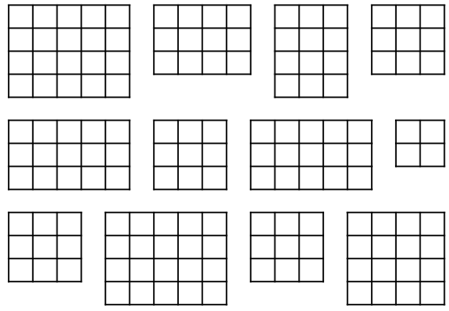
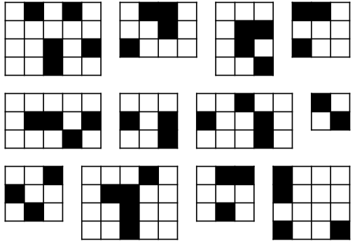
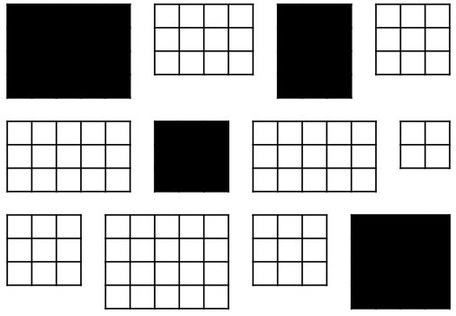
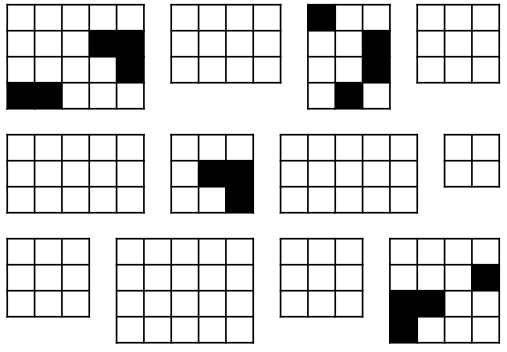

## Outline

<!-- ::: hidden -->

<!-- \newcommand{\fpchpar}{\left(1-\frac{n_h}{N_h}\right)} -->

<!-- \newcommand{\fpcpar}{\left(1-\frac{n}{N}\right)} -->

<!-- ::: -->

::::: columns
::: {.column width="50%"}
**Topics**

-   One-stage Cluster Sampling
    -   Estimation
    -   Sampling weights
    -   CIs
-   Quantifying the Impact of Clustering
    -   ICC
    -   DEFF
:::

::: {.column width="50%"}
**Activities**

-   11.1 One-stage Cluster Sampling
:::
:::::

<br>

**Assignments**

-   Problem Set 3 due Thursday 10/2/25 11:59pm via Carmen

## Cluster Sampling: A Classic Example

-   Want to estimate something about [children in a school]{.alert}

-   Three possible ways to sample:

    1.  Take an SRS of **children** (from a list of all children enrolled at the school)

    2.  Stratify by classroom: take an SRS of **children** within each classroom

    3.  Take an SRS of **classrooms** and then sample either:

        -   All children in that classroom (**one-stage cluster sample**)

        -   An SRS of children in that classroom (**two-stage cluster sample**)

-   In general, cluster sampling **increases** variance relative to an SRS (of the same number of observation units)

-   If units **within** a cluster tend to be more similar than units **between** clusters → obtaining **less information**

-   Not all outcomes ($y$s) would be impacted the same -- which would be more impacted?

    -   Classroom Example A: $y$ = performance on a standardized test
    -   Classroom Example B: $y$ = handedness (left vs right)

## So Why Would We Cluster Sample?

-   **We might have to:** Constructing a sampling frame of observation units may be difficult, costly, or impossible.

    -   Example: want to sample residents of a city, but only have a list of housing units

    -   Example: studying birds in a region, but cannot list all the birds in a region (but perhaps could list geographic units which cover the region)

-   **Cost considerations:** Cluster sampling is usually **cheaper** than SRS

    -   Population may be widely distributed geographically

    -   Population may occur in natural clusters (households, schools, etc.)

    -   For the **same cost** you often can sample **more observation units** in the cluster sample compared to an SRS, thus potentially overcoming the decrease in precision caused by clustering

        -   Example: Target population = all incarcerated juveniles in the U.S.

            -   Might be able to get a list of all incarcerated juveniles (frame), but taking an SRS would mean potentially going to a lot of locations across the U.S. ([1,277 juvenile correctional facilities in 2025](https://www.prisonpolicy.org/reports/pie2025.html))

            -   Much cheaper to take an SRS of the facilities and then interview incarcerated juveniles at the sampled facilities

## Vocabulary of Cluster Sampling

> [**Primary sampling units (PSUs)**]{.alert} = clusters = sampling units

> [**Secondary sampling units (SSUs)**]{.alert2} = elements within clusters = observation units

-   Importantly -- **the observation unit (SSU) is not the sampling unit (PSU)**

-   Can have more than two stages (e.g., children within classrooms within schools within counties...)

<p>

> [**One-stage cluster sample**]{.alert} = Sample **all** SSUs within selected PSUs (e.g., **all** kids in a classroom)

> [**Two-stage cluster sample**]{.alert2} = Sample **some** SSUs within selected PSUs (e.g., **some** kids in a classroom)

-   Throughout this lecture we will assume that **PSUs are selected via SRS** and, for two-stage cluster sampling, **SSUs are selected via SRS**

    -   We will cover another method of selecting PSUs in a later lecture

## Contrasting Cluster Sampling with Stratified Sampling

::: smaller-text
+--------------------------------------------------------------------------------+--------------------------------------------------------------+
| **Stratified Sampling**                                                        | **Cluster Sampling**                                         |
+:===============================================================================+:=============================================================+
| Each element of the population is in exactly one stratum                       | Each element of the population is in exactly one cluster     |
+--------------------------------------------------------------------------------+--------------------------------------------------------------+
| Strata do not overlap, and they cover the whole population                     | Clusters do not overlap, and they cover the whole population |
+--------------------------------------------------------------------------------+--------------------------------------------------------------+
| Population of $H$ strata; stratum $h$ has $n_h$ elements, $N=\sum_{h=1}^H n_h$ | Population of $N$ clusters                                   |
+--------------------------------------------------------------------------------+--------------------------------------------------------------+
| {width="4in"}                                  | {width="4in"}                |
+--------------------------------------------------------------------------------+--------------------------------------------------------------+
| PSU = individual element                                                       | PSU = cluster                                                |
+--------------------------------------------------------------------------------+--------------------------------------------------------------+
| SSU = n/a                                                                      | SSU = individual element                                     |
+--------------------------------------------------------------------------------+--------------------------------------------------------------+

: {tbl-colwidths="\[50,50\]"}
:::

## Contrasting Cluster Sampling with Stratified Sampling

+---------------------------------------------------------------------------------------------------------------------------------------------------------------------------------------------------------------------------------------+--------------------------------------------------------------------------------------------------------------------------------------------------------------------------------------------------------------------------+
| **Stratified Sampling**                                                                                                                                                                                                               | **Cluster Sampling**                                                                                                                                                                                                     |
+:======================================================================================================================================================================================================================================+:=========================================================================================================================================================================================================================+
| SRS of elements within each stratum:                                                                                                                                                                                                  | SRS of clusters and:\                                                                                                                                                                                                    |
|                                                                                                                                                                                                                                       | **One-stage**: take all SSUs in selected PSUs\                                                                                                                                                                           |
| {fig-alt="set of rectangles representing strata, each divided into squares representing observation units. Some squares are shaded black in each stratum showing stratified sampling." width="40%"} | {fig-alt="set of rectangles representing clusters, each divided into squares. All squares in some rectangles are colored black, showing 1-stage cluster sampling" width="40%"}\  |
|                                                                                                                                                                                                                                       | **Two-stage**: SRS of SSUs in selected PSUs\                                                                                                                                                                             |
|                                                                                                                                                                                                                                       | {fig-alt="set of rectangles representing clusters, each divided into squares. Some squares in some rectangles are colored black, showing 2-stage cluster sampling" width="40%"}. |
+---------------------------------------------------------------------------------------------------------------------------------------------------------------------------------------------------------------------------------------+--------------------------------------------------------------------------------------------------------------------------------------------------------------------------------------------------------------------------+
| Sample from **every** stratum                                                                                                                                                                                                         | Only sample from **some clusters**                                                                                                                                                                                       |
+---------------------------------------------------------------------------------------------------------------------------------------------------------------------------------------------------------------------------------------+--------------------------------------------------------------------------------------------------------------------------------------------------------------------------------------------------------------------------+

: {tbl-colwidths="\[50,50\]"}

## Contrasting Cluster Sampling with Stratified Sampling

+--------------------------------------------------------------------------------------------+------------------------------------------------------------------------------------------------+
| **Stratified Sampling**                                                                    | **Cluster Sampling**                                                                           |
+:===========================================================================================+:===============================================================================================+
| Variance of estimate of $\bar{y}_U$ depends on variability of $y$ values **within** strata | Variance of estimate of $\bar{y}_U$ depends primarily on variability **between** cluster means |
+--------------------------------------------------------------------------------------------+------------------------------------------------------------------------------------------------+
| Variance minimized when                                                                    | Variance minimized when                                                                        |
|                                                                                            |                                                                                                |
| -   elements are **similar within strata** but                                             | -   elements are **heterogeneous within cluster** and                                          |
|                                                                                            |                                                                                                |
| -   **stratum means differ**                                                               | -   **cluster means are similar**                                                              |
+--------------------------------------------------------------------------------------------+------------------------------------------------------------------------------------------------+
| *Remember:*                                                                                | *Remember:*                                                                                    |
|                                                                                            |                                                                                                |
| -   [*homogeneous*]{.alert} *within*                                                       | -   [*heterogeneous*]{.alert2} *within*                                                        |
|                                                                                            |                                                                                                |
| -   [*heterogeneous*]{.alert2} *between*                                                   | -   [*homogeneous*]{.alert} *between*                                                          |
+--------------------------------------------------------------------------------------------+------------------------------------------------------------------------------------------------+
| Ignoring stratification often results in variance estimates that are **too big**           | Ignoring clustering often results in variance estimates that are **too small**                 |
+--------------------------------------------------------------------------------------------+------------------------------------------------------------------------------------------------+

: {tbl-colwidths="\[50,50\]"}

## Notation for Cluster Sampling

-   $U$ = the finite population of PSUs
-   $N$ = number of PSUs (clusters) in the **population** (NOT number of observation units/SSUs)
-   $M_0$ = number of SSUs in the **population**
-   $M_i$ = number of SSUs in PSU $i$, with $\displaystyle \sum_{i=1}^N M_i = M_0$
-   $\mathcal{S}$ = a particular sample of PSUs chosen from the population
-   $\mathcal{S}_i$ = the sample of SSUs selected in PSU $i$
-   $n$ = number of PSUs in the **sample**
-   $m_i$ = number of SSUs in the **sample** from PSU $i$
    -   For **one-stage** cluster sampling, $m_i = M_i$ (take all SSUs in the PSU)
-   $y_{ij}$ = characteristic of interest for the $j$th unit in the $i$th PSU/cluster (not a random variable)

## Activity 11.1

One-Stage Cluster Sampling (Part 1)

## Example (from activity)

-   Notation:

    -   PSU = dorm room

    -   SSU = student

    -   $N$ = Number of PSUs (rooms) = 100

    -   $M_i$ = Number of SSUs (students) in PSU (room) $i$ = 4

    -   $M_0$ = Total number of SSUs (students) = 400

    -   $n$ = Number of PSUs (rooms) in the sample = 5

    -   $m_i$ = Number of SSUs (students) in the sample from PSU (room) $i$ = 4 = $M_i$ (one-stage cluster sample)

    -   $y_{ij}$ = GPA for $j$th SSU (student) in PSU (room) $i$

-   You observed **all students** in each dorm room (all SSUs in each PSU)

    -   → You observed the **true total for each sampled PSU,** $\mathbf{t_i}$

-   You took an SRS of dorm rooms (PSUs)

-   No new formulae! Use the results for SRS with [PSU totals]{.alert} as the [observations]{.alert} $(t_i)$

## Example: A Picture

-   Here's my sample of $n = 5$ rooms, with the $m_i=4$ students in each room:

{fig-alt="A comparative data visualization consisting of two tables. The left table presents individual student data with three columns: id, room, and gpa. It includes 20 entries grouped by room numbers (17, 22, 31, 58, and 79), showing student IDs and their corresponding GPAs. The right table aggregates this data, displaying the total GPA per room with two columns: room and total of GPA. Red arrows visually link each student's GPA in the left table to the corresponding room's total GPA in the right table, illustrating the summation process to show an SRS of totals." fig-align="center" width="30%"}

-   If we collapse into **one row per room**, we are back to an SRS, sampling rooms and measuring the "total GPA" in each room!

## One-Stage Cluster Sampling = SRS of TOTALS

-   We now have an SRS of PSUs, with measured variable = **total** $\mathbf{y_{ij}}$ in each room

-   Can use standard SRS formulae -- just substituting $t$ (total) for $y$ (outcome):

::: smaller-text
+----------------+---------------------------------------------------------------------------------+---------------------------------------------------------------------------------------------------+
| **Quantity**   | **Truth**                                                                       | **Estimate**                                                                                      |
+:===============+:================================================================================+:==================================================================================================+
| Mean (of $t$): | $\displaystyle \bar{t}_U = \frac{1}{N} \sum_{i=1}^{N} t_i$                      | $\displaystyle \bar{t}= \frac{1}{n} \sum_{i\in \mathcal{S}} t_i$                                  |
+----------------+---------------------------------------------------------------------------------+---------------------------------------------------------------------------------------------------+
| Variance:      | $\displaystyle V(t_i)=S_t^2 = \frac{1}{N-1} \sum_{i = 1}^N (t_i - \bar{t}_U)^2$ | $\displaystyle \widehat{V}(t_i)= s_t^2=\frac{1}{n-1} \sum_{i \in\mathcal{S}_i} (t_i - \bar{t})^2$ |
+----------------+---------------------------------------------------------------------------------+---------------------------------------------------------------------------------------------------+
:::

-   And remembering that $\bar{t}$ from our sample is a **random variable**, we have that:

::: smaller-text
+-------------------------+-----------------------------------------------------------------------+---------------------------------------------------------------------------------+
| **Expected Value**      | **Variance**                                                          | **Variance Estimate**                                                           |
+:========================+:======================================================================+:================================================================================+
| $E(\bar{t})= \bar{t}_U$ | $\displaystyle V(\bar{t})= \left(1-\frac{n}{N}\right)\frac{S_t^2}{n}$ | $\displaystyle \widehat{V}(\bar{t})= \left(1-\frac{n}{N}\right)\frac{s_t^2}{n}$ |
+-------------------------+-----------------------------------------------------------------------+---------------------------------------------------------------------------------+
:::

-   Remember, $N$ = number of [PSUs]{.alert} in population, $n$ = number of [PSUs]{.alert} in the sample

-   [NOT the number of SSUs!]{.alert2}

## Example (from activity)

:::::: columns
:::: {.column width="50%"}
-   My SRS of dorm rooms was:

::: smaller-text
| Room \# | Total GPA |
|:-------:|:---------:|
|   17    |   12.53   |
|   22    |   14.01   |
|   31    |   13.09   |
|   58    |   10.29   |
|   79    |    13     |
:::
::::

::: {.column width="50%"}
-   $N=100$ (number of rooms in **population**)

-   $n=5$ (number of rooms in **sample**)
:::
::::::

$$\bar{t} = \frac{1}{n} \sum_{i\in \mathcal{S}} t_i = \frac{1}{5} (12.53 + 14.01 + 13.09 + 10.29 + 13) = \frac{62.92}{5} = 12.584$$ $$\widehat{V}(t_i) = s_t^2 =\frac{1}{n-1} \sum_{i \in\mathcal{S}_i} (t_i - \bar{t})^2= \frac{1}{5-1}\left[(12.53-12.584)^2 + \cdots + (13-12.584)^2 \right]= 1.93198$$

$$\widehat{V}(\bar{t}) = \left(1-\frac{n}{N}\right)\frac{s_t^2}{n}= \left(1 - \frac{5}{100} \right) \frac{1.93198}{5} = 0.3670762$$

## From TOTAL to MEAN

-   We don't really want to know about **total** GPA, we want to know about **mean** GPA

-   Fortunately, we can go from one to the other fairly easily:

    -   [Truth:]{.alert} $\bar{y}_U=\frac{\text{total of $y$}}{\text{\# of SSUs}}= \frac{t_U}{M_0}$   →   [Estimate:]{.alert2} $\hat{\bar{y}}_{clus}= \frac{\hat{t}_{clus}}{M_0}$

-   We have $\bar{t}$, how can we get $\hat{t}$?

    -   (# of PSUs) $\times$ (average total in a PSU) = total across all PSUs

    -   [Truth:]{.alert} $N \times \bar{t}_U = t$   →   [Estimate:]{.alert2} $N \times \bar{t}= \hat{t}_{clus}$

-   Thus this gives us, for the **mean** of $y$:

    -   [Truth:]{.alert} $\bar{y}_U= \frac{t_U}{M_0} = \frac{N \bar{t}_U}{M_0}$   →   [Estimate:]{.alert2} $\hat{\bar{y}}_{clus}= \frac{\hat{t}_{clus}}{M_0} = \frac{N \bar{t}}{M_0}$

-   And of course we need variances... but conveniently $N$ and $M_0$ are constants!

    -   [Truth:]{.alert} $V(\hat{\bar{y}}_{clus}) = V\left(\frac{N \bar{t}}{M_0}\right) = \frac{N^2}{M_0^2}V(\bar{t}) = \frac{N^2}{M_0^2} \left(1-\frac{n}{N}\right)\frac{S_t^2}{n}$

## One-Stage Cluster Sampling – Estimator for the Mean

| Quantity | Truth | Estimate |
|----|----|----|
| Overall mean (of $y$): | $\displaystyle \bar{y}_U = \frac{t}{M_0}$ | $\displaystyle \hat{\bar{y}}_{clus}= \frac{\hat{t}_{clus}}{M_0}= \frac{N\bar{t}}{M_0}$ |
| Variance of $\hat{\bar{y}}_{clus}$: | $\displaystyle V(\hat{\bar{y}}_{clus}) = \frac{N^2}{M_0^2} \left(1-\frac{n}{N}\right)\frac{S_t^2}{n}$ | $\displaystyle  \widehat{V}(\hat{\bar{y}}_{clus}) = \frac{N^2}{M_0^2} \left(1-\frac{n}{N}\right)\frac{s_t^2}{n}$ |

::: smaller-text

-   Importantly, $\hat{\bar{y}}_{clus}$ is **unbiased**: $E(\hat{\bar{y}}_{clus}) =$

-   Remember,

    -   $N$ = Number of PSUs in **population**

    -   $n$ = Number of PSUs in **sample**

    -   $M_0$ = Total number of SSUs in **population**

-   So to estimate the mean of $y$ we...

    -   calculate the average cluster total across the sampled PSUs $(\bar{t})$,

    -   multiply this average by the number of PSUs $(N)$ to get a grand total $(\hat{t}_{clus})$

    -   and divide by the total number of SSUs $(M_0)$ to get an overall mean $(\hat{\bar{y}}_{clus})$

:::

## Example (from activity)

-   In my SRS of dorm rooms, I had:

    -   $N=100$ (number of rooms in **population**)

    -   $n=5$ (number of rooms in **sample**)

    -   $M_0 = 400$ (number of students in **population**)

    -   Estimated mean PSU (room) total: $\bar{t}= 12.584$

    -   Estimated variance of PSU (room) totals: $s_t^2 = 1.93198$

-   My resulting estimates:
      
      -   $\hat{\bar{y}}_{clus}= \frac{N\bar{t}}{M_0} = \frac{100 \times 12.584}{400} = 3.146$
      
      -   $\widehat{V}(\hat{\bar{y}}_{clus}) = \frac{N^2}{M_0^2} \left(1-\frac{n}{N}\right)\frac{s_t^2}{n}= \frac{100^2}{400^2} \left(1 - \frac{5}{100} \right) \frac{1.93198}{5} = 0.0229$
      
      -   $\widehat{SE}(\hat{\bar{y}}_{clus}) = \sqrt{Var} = \sqrt{0.0229} = 0.151$

*Note: The true population mean GPA is* $\bar{y}_U = 2.836075$

## Sampling Weights in One-Stage Cluster Samples

-   When clusters are sampled with equal probability (i.e., via an SRS), an [SSU is included in the sample if the PSU is included in the sample]{.alert}

-   Each PSU has probability $n/N$ of being selected (SRS of $n$ out of $N$ PSUs)

-   Thus the sample weight for sampled SSU $j$ in PSU $i$ is: $$w_{ij} = \frac{1}{P(\text{SSU $j$ of PSU $i$ included in sample})} = \frac{1}{\pi_{ij}} = \frac{N}{n}$$

-   Compare to an SRS:

    -   If all PSUs had $M_i=M$ elements, then the population size is $NM$ and the one-stage cluster sample has $nM$ units

    -   An SRS of $nM$ units out of $NM$ units: $w_i = \frac{NM}{nM} = \frac{N}{n}$ = [same as the one-stage cluster sample]{.alert2}

    -   So point estimates would be the same -- [but variance estimates would be different]{.alert}

-   For the GPA cluster sample, $w_{ij} = \frac{N}{n} = \frac{\text{\# of PSUs in \textbf{population}}}{\text{\# of PSUs in \textbf{sample}}} = \frac{100}{5} = 20$

## Confidence Intervals for One-Stage Cluster Samples

-   An approximately $\alpha$-level confidence interval for the true mean $\bar{y}_U$ is given by: 
$$\left(\hat{\bar{y}}_{clus}- t_{\alpha/2,n-1} \sqrt{\widehat{V}(\hat{\bar{y}}_{clus})}, \quad \bar{y}_{str}+ t_{\alpha/2,n-1} \sqrt{\widehat{V}(\hat{\bar{y}}_{clus})}\right)$$ where $t_{\alpha/2,n-1}$ is the $(1-\alpha/2)$th percentile of a $t$ distribution with [DF = $n-1$]{.alert}

<br>

-   Often the number of PSUs sampled is not large, thus we most often use $t$ (instead of $Z$)

-   Again, you may see the DF "rule" written as **"DF = \# of PSUs $\mathbf{-}$ \# of Strata"**

    -   PSU = Primary Sampling Unit = cluster
    
    -   If no stratification, then DF = $n-1$ = \# PSUs $-1$

## Activity 11.1

One-Stage Cluster Sampling (Part 2)

## Partitioning Variability Between and Within Clusters

:::::: .smaller-text
-   When we take a cluster sample, we often **lose precision (i.e., have increased variance)** (relative to SRS)

-   E.g., in the activity: students living in same room have more "similar" GPAs

::::: columns
::: {.column width="70%"}
Ideally:

-   We want each cluster to be a mini version of the population -- like if each cluster were an SRS of the population

-   If true, [$SSB \approx 0$]{.alert}\
    (cluster means are similar, and all the variability is within a cluster)
:::

::: {.column width="30%"}
{width="\\textwidth"}
:::
:::::

::::: columns
::: {.column width="70%"}
However, the reality usually is:

-   Usually units are [more similar within a cluster]{.alert} (e.g., similarity within household, similarity within dorm room)

-   If true, [$SSB > 0$]{.alert}
:::

::: {.column width="30%"}
{width="\\textwidth"}
:::
:::::

::::::

## Partitioning Variability Between and Within Clusters

-   We can return once again (like we did with stratification) to the idea of **partitioning sums of squares** to see the impact of clustering

-   This is like a one-way ANOVA, where the "grouping" variable is the cluster/PSU:

$$\begin{aligned}
\text{Total Sum of Squares} &{}= \text{Between PSUs} + \text{Within PSU}\\
SST &{}= SSB + SSW \\
\sum_{i=1}^N \sum_{j=1}^{M_i} (y_{ij}- \bar{y}_U)^2 &{} = \underbrace{\sum_{i=1}^N \sum_{j=1}^{M_i} (\bar{y}_{Ui} - \bar{y}_U)^2}_{\text{\textbf{between} clusters: } SSB}  +  \underbrace{\sum_{i=1}^N \sum_{j=1}^{M_i} (y_{ij}- \bar{y}_{Ui})^2}_{\text{\textbf{within} clusters: } SSW}
\end{aligned}$$

-   [Between-cluster variability]{.alert} = how far are PSU means from overall mean (want [small]{.alert})

-   [Within-cluster variability]{.alert2} = how far are SSUs from their PSU average (want [large]{.alert2}) (relatively speaking)


*Here we are looking at the population -- so, all the* $y_{ij}$, not just the sampled ones

## Partitioning Variability Between and Within Clusters

**When all clusters are the same size, i.e.,** $M_i=m_i=M$:

**ANOVA Table**

  Source         DF       Sum of Squares                                                    Mean Square
  -------------- -------- ----------------------------------------------------------------- -----------------------------------------
  Between PSUs   $N-1$     $SSB=\sum_{i=1}^N \sum_{j=1}^{M} (\bar{y}_{Ui} - \bar{y}_U)^2$   $MSB = \frac{SSB}{N-1}$
  Within PSUs    $NM-N$    $SSW=\sum_{i=1}^N \sum_{j=1}^{M} (y_{ij} - \bar{y}_{Ui})^2$      $MSW = \frac{SSW}{NM-N}$
  Total          $NM-1$    $SST=\sum_{i=1}^N \sum_{j=1}^{M} (y_{ij} - \bar{y}_U)^2$         $S^2 = \frac{SST}{NM-1}$

<p>

-   [**Between-cluster**]{.alert} variability: $SSB$ = how far are PSU means $(\bar{y}_{Ui})$ from overall mean $(\bar{y}_U)$

-   [**Within-cluster**]{.alert2} variability: $SSW$ = how far are SSUs $(y_{ij})$ from their PSU average $(\bar{y}_{Ui})$

-   **Total** variability: $SST$ = how far are SSUs $(y_{ij})$ from overall mean $(\bar{y}_U)$

-   We will use this ANOVA decomposition to obtain a DEFF (design effect)

## Intracluster Correlation Coefficient (ICC)

-   Goal: quantify the impact of the clustering (how "similar" are SSUs in same PSU?)

-   **Assume all clusters are the same size, i.e.,** $M_i = m_i = M$

> **[ICC]{.alert2}** = Intracluster Correlation Coefficient: &nbsp; $ICC = 1 - \frac{M}{M-1} \frac{SSW}{SST}$

-   Properties of ICC:

    -   Measures how similar SSUs in the same PSU are, relative to overall variability of SSUs

    -   Since $0 \le SSW/SST \le 1$, the ICC is bounded: $-\frac{1}{M-1} \le ICC \le 1$

    -   If all elements in a cluster are the same, then $SSW=0$ and ICC = 1

    -   [If ICC $>$ 0, cluster sampling is **less efficient** than simple random sampling of elements]{.alert}

    -   The ICC is equivalent to the Pearson correlation between all pairs of observation units from the same PSU in the population

-   Warning: ICC is only defined for one-stage cluster samples with **equal cluster sizes**


## Example Calculation of ICC (from activity)

-   Using the **full population data**, I ran a one-way ANOVA for the GPA data ($M=$ 4 students per room, $N=$ 100 rooms):

```{r}
#| echo: true
#| classes: .cell-output
pop <- read.csv("./datasets/gpa.csv")
anova_model <- aov(gpa ~ factor(room), data=pop)
summary(anova_model)
```
<p>

-   From this we can calculate the true (theoretical) ICC:

    -   $ICC = 1 - \frac{M}{M-1} \frac{SSW}{SST} = 1 - \frac{4}{4-1} \frac{46.38}{46.38+54.37} = 0.386$

    -   $ICC = 0.386 > 0$ so clustering will **increase variance** relative to SRS

## Design Effect

-   Just like with stratification, we use the **design effect (DEFF)** to quantify the impact of clustering

-   Assuming all clusters are the same size ($M_i=M$), a one-stage cluster sample of $n$ PSUs has $nM$ SSUs

-   Compare the variance of the mean to an SRS of size $nM$ (out of $NM$ SSUs)

-   Design effect (DEFF) for the estimated overall mean from 1-stage cluster sample[^2]: $$\begin{aligned}
    \text{deff}(\hat{\bar{y}}_{clus}) &{}= \frac{V_{clus}(\hat{\bar{y}}_{clus})}{V_{srs}(\bar{y})} \\
    &=\frac{NM-1}{NM-M}[1+(M-1)ICC] \\
    & \approx 1+(M-1)ICC \quad \text{[if $N$ is large so }NM-1 \approx NM-M]
    \end{aligned}$$

-   Thus, for each [1 SSU in an SRS]{.alert}, you need [$[1+(M-1)ICC]$ SSUs from a one-stage cluster sample]{.alert2} to get the same amount of information

[^2]: Full derivation on Carmen if you're interested (OPTIONAL)

## Example Calculation of DEFF (from Activity)

-   For the students (SSUs) within rooms (PSUs) the true, theoretical ICC = $0.386$

-   $M = 4$ students per room (SSUs per PSUs)

<p>

-   DEFF = $1+(M-1)ICC =$

<p>

-   Would need to sample **more than twice as many students** with clustered design as if we took an SRS (of the same number of SSUs)

-   Note #1: This is the **true ICC** and **true (theoretical) DEFF**. When calculating ICC and DEFF from a cluster sample, you'll only get **estimates** of these quantities.

-   Note #2: In practice, clusters are rarely the same size -- but we can still calculate the DEFF (using software)

## Activity 11.1

One-Stage Cluster Sampling (Part 3)
