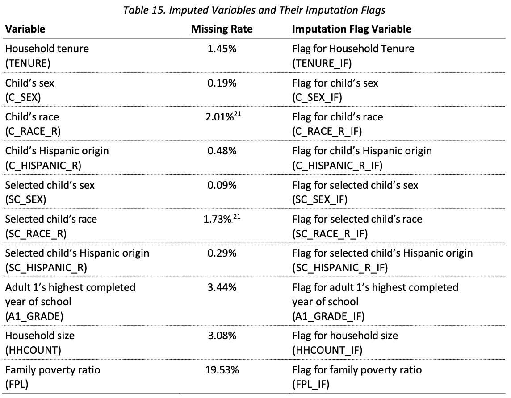

## Outline

<!-- ::: hidden -->

<!-- \newcommand{\ybar}{\bar{y}} -->

<!-- ::: -->

::::: columns
::: {.column width="60%"}
**Topics**

-   What is imputation?

-   When and why would we impute?

-   Overview of *some* imputation methods

    -   Hot Deck Imputation

    -   Sequential Regression Imputation

-   Single vs Multiple imputation
:::

::: {.column width="40%"}
**Activities**

-   19.1: Exploring Imputation
:::
:::::

**Readings**

-   **OPTIONAL**: Andridge, R.R. and Little, R.J., 2010. A review of hot
    deck imputation for survey non-response. *International Statistical
    Review*, 78(1), pp.40-64. (PDF on Carmen)

**Assignments**

-   Group Progress Report 3 due Thursday 11/6/2025 11:59pm via Carmen

## What is Imputation?

> **Imputation** = filling in missing data values (in a principled way)
> to create a "complete" data set

:::::::: columns
:::: {.column width="30%"}
::::
:::: {.column width="10%"}
::: even-smaller-text
| **Y** | **Z** |
|-------|-------|
| 15    | 11    |
| 25    | 13    |
|       | 10    |
| 13    | 8     |
| 13    | 7     |
|       | 9     |
| 16    | 10    |
| 20    | 13    |
| 21    | 10    |
|       | 8     |
:::
::::

::: {.column width="2%"}
→
:::

:::: {.column width="10%"}
::: even-smaller-text
| **Y**            | **Z** |
|------------------|-------|
| 15               | 11    |
| 25               | 13    |
| [**20**]{.alert} | 10    |
| 13               | 8     |
| 13               | 7     |
| [**13**]{.alert} | 9     |
| 16               | 10    |
| 20               | 13    |
| 21               | 10    |
| [**15**]{.alert} | 8     |
:::
::::
::::::::

-   Important point:

    -   The goal of imputation **is not** to perfectly replicate the
        data value that would have been observed

    -   The goal of imputation to replace missing values by "plausible"
        values in order to make use of all available information (i.e.,
        other info we have about a survey respondent) so that
        **population inference** is improved (relative to discarding
        missing data)

## When and Why We Impute (in sample surveys) {.pause}

-   Imputation is used across many application areas

-   General benefits of imputation:

    -   Potential for gain in efficiency relative to complete case

    -   Potential for reduction in nonresponse bias relative to complete
        case

. . .

-   In general:
    -   Imputation is for **item nonresponse**
    -   Weighting adjustments are for **unit nonresponse**

. . .

-   For **complex sample surveys**, the two most common reasons for
    imputing are:

    1.  There is missing data on variables (collected on the survey)
        that will be used for weight adjustments (post-stratification,
        raking, etc.)

    2.  Key survey outcomes have missingness and we don't want different
        analysts to get different answers

-   Generally speaking, imputation for both of these reasons will be
    **done by the survey producers** (e.g., CDC) and the imputed data
    provided to secondary data analysts (often with imputation "flags"
    so you know which values have been imputed)

## Examples of Imputation in Large Scale U.S. Surveys

-   [**Census Household Pulse
    Survey**](https://www.census.gov/data/experimental-data-products/household-pulse-survey.html)

    -   [Items imputed:]{.alert} age, sex, Hispanic origin, race,
        educational attainment

    -   [Why:]{.alert3} variables needed for post-survey weight
        adjustments (raking)

-   [**National Survey of Children's Health
    (NSCH)**](https://www.census.gov/programs-surveys/nsch.html)

    -   [Items imputed:]{.alert} household tenure, child's sex, child's
        race, child's hispanic origin, adult 1's education, household
        size, family poverty ratio

    -   [Why:]{.alert3} variables used for post-survey weight
        adjustments (raking)

-   [**National Immunization Survey -
    Child**](https://www.cdc.gov/nis/php/datasets-child/index.html)

    -   [Items imputed:]{.alert} sex, Hispanic origin, race, health
        insurance status, and first-born status of the child; education
        level, age group, marital status, and mobility status of the
        mother; income-to-poverty ratio of the household

    -   [Why:]{.alert3} variables used for post-survey weight
        adjustments (raking)

## Imputed Items Tend to Have Low Nonresponse Rates {.nostretch}

-   Demographic variables are the most commonly imputed (for use in
    weight adjustments)

-   Item nonresponse for these items tends to be low

-   Example: **National Survey of Children's Health (NSCH) -- 2022**

:::::: columns
::: {.column width="40%"}
{fig-alt="alternate text here"
fig-align="center"}
:::

:::: {.column width="60%"}
::: smaller-text
-   Screener sample size = 127,726

    -   Most missingness: Child's race -- 2,568 missing (2.01%)

-   Topical survey sample size = 54,103

    -   Most missingness: Poverty ratio -- 10,567 missing (19.53%)

    -   Next most missingness: Adult education -- 1,860 missing (3.44%)

-   Very low rates of missingness for all demographics except poverty
    level

-   Poverty level based on income -- usually high nonresponse for this
    item on all surveys!
:::
::::
::::::

Source: [2022 NSCH Methodology
Report](https://www2.census.gov/programs-surveys/nsch/technical-documentation/methodology/2022-NSCH-Methodology-Report.pdf),
p.40

## Some Common Imputation Methods (for sample surveys)

-   There are a lot (a semester's worth) of imputation methods -- here
    are just two:

::::: columns
::: {.column width="50%"}
**Hot Deck Imputation**

-   [Most common]{.alert} imputation method for sample surveys

-   Examples of surveys that use it (or a variation):

    -   [National Survey of Children's
        Health](https://www.census.gov/programs-surveys/nsch.html) \
        (for demographics)

    -   [National Immunization Survey -
        Child](https://www.cdc.gov/nis/php/datasets-child/index.html)

    -   [General Social Survey (GSS)](https://gss.norc.org/)

    -   [Ohio Medicaid Assessment Survey](https://grc.osu.edu/OMAS)

    -   [Census Household Pulse
        Survey](https://www.census.gov/data/experimental-data-products/household-pulse-survey.html)

:::

::: {.column width="50%"}
**Sequential Regression Imputation**

-   [Less common]{.alert2} imputation method for sample surveys

-   Examples of surveys that use it:

    -   [National Survey of Children's
        Health](https://www.census.gov/programs-surveys/nsch.html) \
        (for income/FPL)

    -   [National Health Interview
        Survey](https://www.cdc.gov/nchs/nhis/index.htm) \
        (for income)

    -   [National Survey of Family
        Growth](https://www.cdc.gov/nchs/nsfg/index.htm)
:::
:::::

## Hot Deck Imputation

> [**Hot Deck Imputation**]{.alert} = Replacing missing values of one or more
> variables for a nonrespondent ("recipient") with observed values from
> a respondent ("donor") that is similar with respect to characteristics
> observed for both

{width="50%" fig-align="center" fig-alt="An illustration of hot deck imputation where a missing value from a recipient is replaced with a value from a similar donor. The image shows a male, 44-year-old, married recipient with a missing income value. The missing value is filled in with the income of a similar donor: a male, 40-year-old, married person with an income of $57,000/yr. The imputed income for the recipient becomes $57,000/yr."}

::::: {.columns}
::: {.column width="70%"}
-   Why is it "Hot"? 

      -   Throwback to punch cards for computers 
      
      -   Donors come from cards currently being processed ("hot")
      
      -   Alternative: "Cold" deck = data from external data set
:::
::: {.column width="20%"}
{fig-alt="A pair of old-fashioned data punch cards, with a fire emoji above them. The card in the foreground is a standard, beige-colored IBM 80-column card, with columns of numbers and punched holes. A smaller, pink card is behind it."}
:::
:::::

## Basic Steps of the Hot Deck

1.  **Identify possible donors:** Create set of possible donor(s) for
    each recipient

2.  **Select a donor:** Select a single donor for each recipient

3.  **Impute:** Use donor's observed value(s) to fill in recipient's
    missing value(s)

-   Example: 2017 Ohio Medicaid Assessment Survey ([link](https://grc.osu.edu/OMAS/2017Survey))

      -   25 variables imputed one at a time using hot deck imputation[^1]
      
            -   Impute **region** based on **phone type**
            -   Impute **adult gender** based on (imputed) **phone type** and **region**
            -   Impute **adult race** based on (imputed) **phone type** and **region** and **adult gender**

[^1]: OMAS uses a variation on hot deck imputation called "weighted
    sequential hot deck" -- this is a method that takes the survey
    weights into account when doing the imputation.
    
## Why Hot Deck Imputation is Popular for Surveys {.pause}

-   Only plausible values can be imputed

    -   You're only imputing data values that were actually observed in
        the survey

. . . 

-   Less sensitive to model misspecification than an imputation method
    based on a parametric model (though there is an implicit model)

    -   Remember, we treat $y$ as a fixed quantity and don't make
        assumptions like $Y \sim N(\mu, \sigma^2)$

    -   Thus, survey statisticians tend to try to avoid the use of
        (parametric) models

. . . 

-   Extends to imputing multivariate missingness (preserving
    associations)

    -   If multiple variables are missing for a recipient,
        can impute them together from the same donor

    -   Example: Both race and Hispanic origin missing -- could impute
        the pair, meaning we preserve association between race and
        ethnicity

. . . 

**Note:** I could spend (and have spent!) a full day talking about hot
deck imputation and its variations...my hope is that you understand the
basic idea of how hot deck imputation works and recognize it when you
see it described in data user guides!

## Sequential Regression Imputation

(the sometimes-used imputation method for surveys)

> [**Sequential Regression Imputation**]{.alert3} = Replacing missing values of one
> or more variables for a nonrespondent with a draw from a predictive
> distribution that is based on a regression model

{fig-align="center" width="80%" fig-alt="An illustration of a dataset with missing data. The top of the image shows six respondents with complete data (demographics and income). The bottom shows a nonrespondent with a missing income value."}

-   To impute missing income value:

      1.   Predict income using gender, age, and marital status as covariates
          in regression model
      
      2.   Obtain prediction for the nonrespondent's income based on the model
      
      3.   Add extra "noise" to both the regression coefficients and the
          imputed value

-   This is a simplification of a complex process!

## Imputation Is Complex!

-   Lots and lots of possible methods...

-   Added complexity of different **patterns** of missing data:

{width="23%" fig-alt="An illustration of a dataset with univariate missing data. The dataset is represented by a grid of rows and columns. The columns are labeled Y1, Y2, Y3, and Y4. The cells in the first three columns, Y1, Y2, and Y3, are filled. The cells in the fourth column, Y4, are partially missing, indicated by a shaded pattern and question marks in the bottom half of the column. This shows that data is only missing for a single variable, Y4."}
{width="23%" fig-alt="An illustration of a dataset with unit nonresponse. The dataset is a grid of rows and columns, with the columns labeled Y1, Y2, Y3, and Y4. The cells in the first two columns, Y1 and Y2, are filled. The cells in the last two columns, Y3 and Y4, are completely missing for the bottom half of the dataset, indicated by a shaded pattern and question marks. This shows that all data for a specific set of records (rows) is entirely missing."}
{width="23%" fig-alt="An illustration of a dataset with monotone missing data. The dataset is a grid of rows and columns, with the columns labeled Y1, Y2, Y3, and Y4. The missing data forms a staircase or stepped pattern. Specifically, data is missing in column Y4 for the bottom rows. Then, for a lower set of rows, data is missing in both columns Y3 and Y4. Finally, for the very bottom rows, data is missing across columns Y2, Y3, and Y4. The missing cells are indicated by a shaded pattern and question marks. This pattern suggests that if a value is missing for a particular variable, all subsequent variables for that same record (row) are also missing."}
{width="23%" fig-alt="An illustration of a dataset with a swiss cheese missing data pattern. The dataset is a grid of rows and columns, with the columns labeled Y1, Y2, Y3, and Y4. The missing cells, indicated by a shaded pattern and question marks, are scattered randomly throughout the dataset, much like the holes in a block of Swiss cheese. This contrasts with a monotone pattern where the missing data forms a stepped or triangular shape."}

-   Want to know more about missing data and imputation?
-   We have a whole course: PUBHBIO 7240/STAT 6520 (Applied Statistical Analysis with Missing Data)

## Activity 19.1

Exploring Imputation

## What You Just Did: Single Imputation

> [**Single Imputation:**]{.alert} Replace each missing value with **one** value

-   Create **one** completed data set
-   Analyze that one data set as usual

  
-   Each missing income value was replaced with **one** value

-   But, when you analyzed the imputed data, you were effectively treating
the imputed data **as if it had been actually observed!**

-   Look at the class results... what do we see about the estimated precision
(SEs) for the data sets with imputed data compared to the "oracle" data?

-   No "penalty" for the fact that we imputed instead of observed some values --- but there should have been, right?

## Single vs Multiple Imputation

> [**Multiple Imputation:**]{.alert2} Replace each missing value with **multiple**
values

-   Create **multiple** completed data sets
-   Analyze each data set separatedly and combine the resulting
estimates using special combining rules ("Rubin's Rules")

-   Resulting inference properly treats the imputed data **not** as if it were known[^2]

[^2]: It's not the only option -- there are methods for obtaining
    correct variance estimates from singly imputed data, outside the
    scope of this class

-   Multiple imputation more often used with non-probability/convenience
samples (e.g., observational studies, clinical trials)

-   Applying multiple imputation in survey context is (more) complicated ---
have to properly account for the sample design

-   Some publicly available surveys *do*   release multiply imputed data --- most
often income data (e.g., NSCH, NHIS) --- why might this be?
